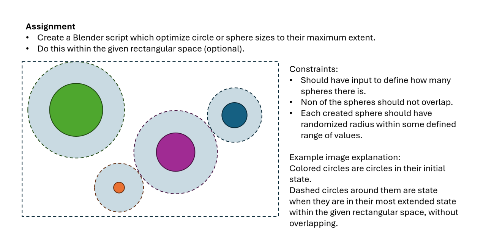
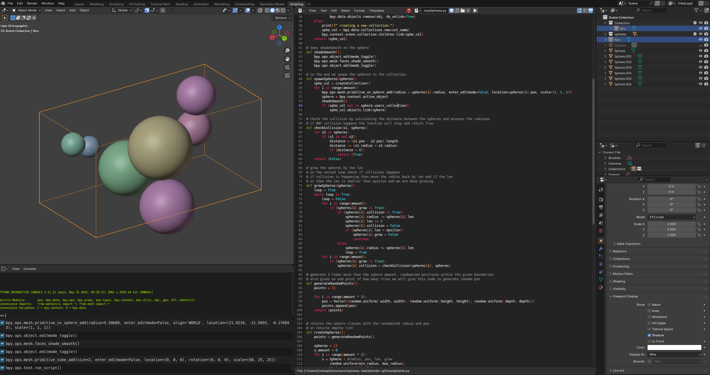

# [Automated Blender Script, Python September 2025](https://github.com/Emihaa/BlenderSpheres)

## My First Mentor Assignment: Automating Sphere Growth in Blender with Python

When I started at Hive Helsinki in October 2024, my goal was to strengthen my foundational programming skills to support my path toward becoming a technical artist. A year into the curriculum, I reached out to [Antti Veräjänkorpi](https://www.linkedin.com/in/anttiv79/) (Bit of Byte), asking him to be my mentor and to help me build my Technical Artist portfolio.
He gave me a Blender automation script assignment to assess my coding skills, logical thinking, and creative problem-solving. The assignment sounded simple at first, but it quickly turned into a fun and challenging project that taught me far more than I expected.

## The Assignment

Goal:
- Create a Blender script that optimizes circle or sphere sizes to their maximum extent.
- Do this within the given rectangular space (optional).

Constraints:
- Should have input to define how many spheres there is.
- Non of the spheres should not overlap.
- Each created sphere should have a randomized radius within some defined range of values.

The Example Image Explanation:
Colored circles show the initial state of the circles. Dashed circles around them are the state when they are I their most extended state within the given rectangular space, without overlapping.

## My Approach

I had two weeks to complete the assignment. This was my first time scripting in Blender and also my first project in Python, so I had to learn both the Blender API and the Python syntax.
I first figured out how to instantiate the spheres in Blender based on the given constraints (inside a box basically).

After that, I built a while loop that iteratively grew each sphere. In each iteration:
The script calculated the distance between every pair of spheres.
It subtracted the radii of both spheres from that distance and halved the result.
That value determined how much each sphere could grow without overlapping.
If the remaining space between any two spheres was smaller than a given epsilon threshold, the growth stopped.
Then do the same to the next sphere.

When none of the spheres could grow anymore, the loop ended, leaving a set of perfectly optimized, non-overlapping spheres filling the space.
The last thing I did was this white-noise scatter logic to generate random initial positions for the spheres, making sure none of them spawned inside each other.

More of that here if you are interested: [Link here.](https://extremelearning.com.au/unreasonable-effectiveness-of-quasirandom-sequences/)
  
      
 

## The Feedback

The feedback I received was eye-opening.

Even though my script was working, an accomplishment I was very proud of, considering I had learned Python syntax and completed my first script with it within two weeks while working and studying, my mentor’s feedback made me rewrite the core of my script 3 times.
The biggest lesson I learned was to separate the code from the art. Coming from a 3D art background, I naturally tend to approach problems visually. My first reaction was to spawn all the spheres immediately, because that’s what made sense visually. But in programming, especially for optimization tasks, this is unnecessary and not optimized.

Instead, I learned that I should first run the logic and math in the background, and only after everything is calculated, instantiate the visuals. No one sees the spheres growing in real time anyway, so why waste computation on scaling them physically?
This realization made my script simpler, lighter, and faster. And also shorter. I rewrote it so that each sphere became a Sphere class, storing all its necessary parameters like position and radius of the sphere. The growth now happens entirely in data, not in visible geometry, and only after the process is complete are the final spheres instantiated in Blender visible to the user.

The second major improvement was code reusability. My first solution used a custom white-noise system to scatter the spheres randomly without overlap. It worked, but it was just a bit unnecessary. In my rewritten version, I added a checkCollision() function to handle overlap detection and reused that same function for both position generation and the growth logic.
This meant less code, more clarity, and better readability.

## Reflection

Overall, I had a lot of fun working on this assignment.
Python turned out to be far less intimidating than I expected, especially after getting used to C and C++ at Hive. It actually felt quite approachable.

I do miss my curly brackets, though.

---------------------------------------------------------------------------------------------------------------------------------------------------------------
---------------------------------------------------------------------------------------------------------------------------------------------------------------
