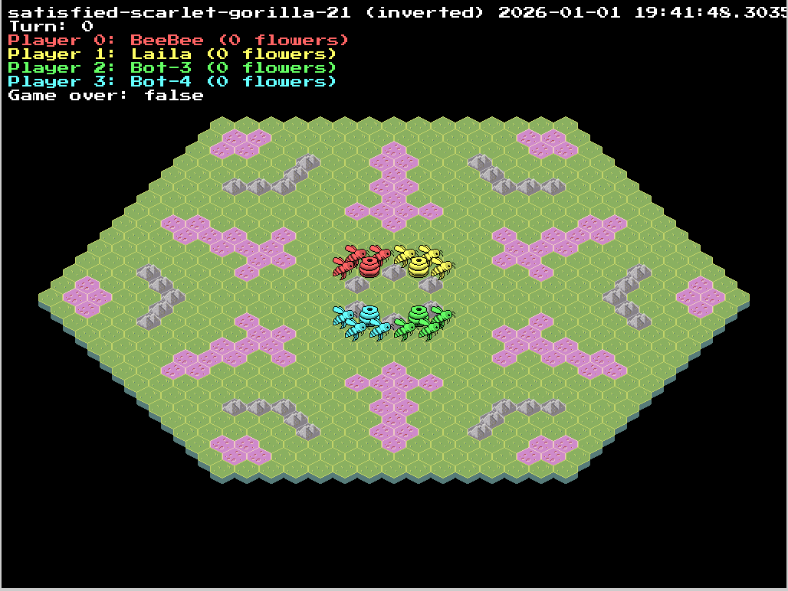
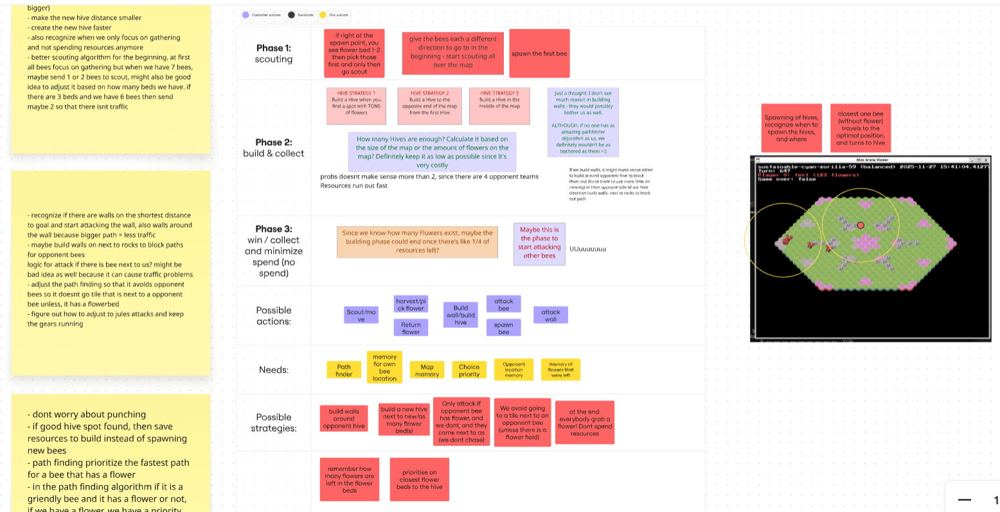

# Hive Arena – AI Agent

## The challenge
Hive Arena was a two-week team competition organized by Hive Helsinki, where students designed an algorithmic agent for a turn-based resource-gathering game. The project was implemented in Go, a language none of our team members had previously used. Teams competed by letting their agents play against each other, with no control from us once the game started.

## The game
The game mechanics are simple. On their turn the bees could move, gather flowers, attack, build walls or hives, spawn new bees, or do nothing. Flowers acted both as a resource for action and as a win condition. Each bee’s action order was randomized, and visibility was limited to a three tile radius, meaning the map had to be explored under fog-of-war conditions. All bees shared a hive mind so once something was discovered, it was known to all bees.

*Hive Arena game map with different teams as bees*

## The team
Our team had three people. We planned strategies and tactics using a shared Miro board and divided responsibilities, with the goal of having a working baseline even within the two week deadline. We also used Visual Studio Codes agent and chatGPT to help us understand and write Go code as it was new for us, and we had a strong "vibe code" mentality. [Go language website](https://go.dev/ref/spec) was also usefull with its documentation.

*Our team miro board for planning strategies and methods*

## Pathfinding & Scouting

My primary responsibility was pathfinding and scouting logic. Because I had recently worked on grid-based maze algorithm in Python, I first tested pathfinding algorithm in my Python maze project and then after having understood the logic, translated it into Go. At first, I programmed a breadth-first search algorithm, but later upgraded it to [A*](https://www.redblobgames.com/pathfinding/a-star/introduction.html) for more efficient and optimized alternative.

Pathfinding workedg great for known targets: moving to flowers, returning to hives, and navigating around obstacles. The difficulties came from scouting under limited visibility. At the start of the game, bees may not see any resources(flowers), so exploration become necessary. My team implemented a shared memory grid that stored discovered tiles, but recognizing between unexplored tiles and the void beyond map borders turned out to be a challenge. Since the scouting was the last unfinished part of the agent, and the deadline was the next day, I was too afraid to change the foundation of the explored map, incase of blowing up rest of the code.

Instead, I tried to add an additional exploration logic layered on top of the grid/map, marking explored versus unknown areas. While the scouting system was not as great or even fully working as intended, it worked well enough to prevent the scout bee from getting stuck trying to access void beyond the map.

*Gameplay testing of our agent in all four different teams*

Additionally, our team assigned roles to the bees, the roles included scout, harvester, and guard. My teammates created a offence strategy, where the guard bees build walls around enemy hive to block the path. This made me happy as a strategy gamer, it brought me joy to see proper strategy planning and offence.

## Results

In the end, our team placed last in the competition. This was largely due to technical issues during the event, Wi-Fi disconnection caused us to time out from multiple matches. We also had unforseen issues in our algorithm, such as not checking whether a target flower was actually reachable and so getting the bee stuck.

Despite the unfortunate result, I enjoyed this learning experience. I leaner about pathfinding algorithms, Go language, Git management in a team, and many others. And overall, I just had fun.
