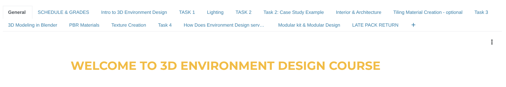
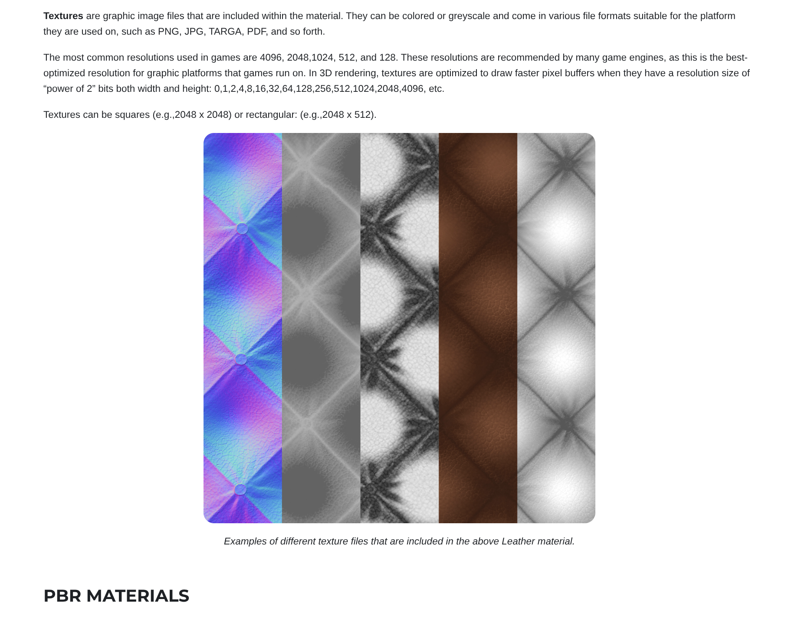
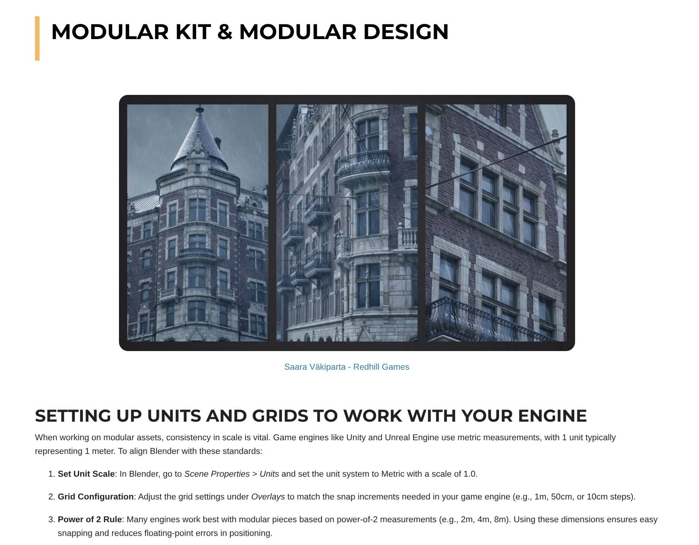
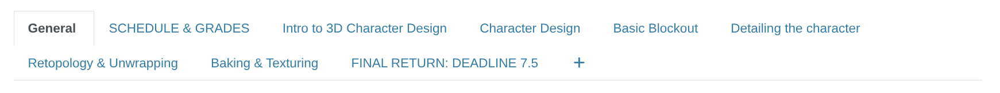
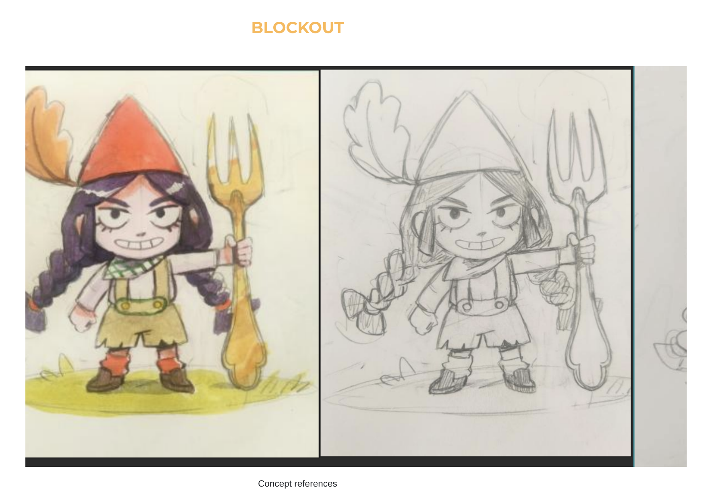
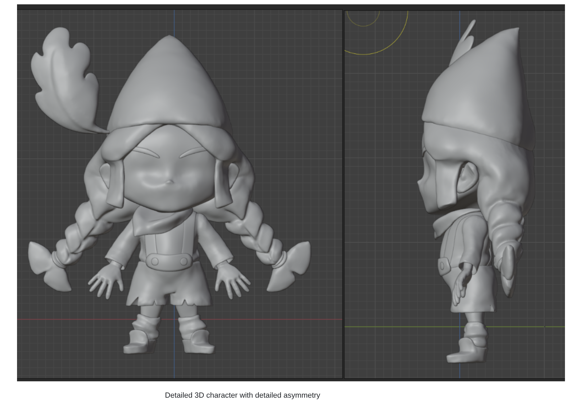

# Technical Artist Portfolio

## About Me

Experienced 3D artist with several years of experience from the mobile game industry, including senior and lead roles. Currently expanding my technical skillset through studies at Hive Helsinki, an intensive software engineering program, to develop as a technical artist who connects art and code.

## Contact Details
- [Linkedin](https://www.linkedin.com/in/emilia-haanp%C3%A4%C3%A4-25a88070)
- [ArtStation](https://www.artstation.com/emihaa)
- [Github](https://github.com/Emihaa)
- [CV](https://www.canva.com/design/DAGkP6-mzDo/y7aw6FWe4J6OfEcBOld1YQ/edit?utm_content=DAGkP6-mzDo&utm_campaign=designshare&utm_medium=link2&utm_source=sharebutton)

## Course lecturer at Xamk, University of Applied Sciences

I have two courses that I have been teaching since the beginning of 2024. *3D Environment Design & 3D Character Design.*

In both courses, I combine artistic principles with technical workflows, giving students skills and creativity to bring their ideas to life, but also the technical understanding needed for the pipeline of game production. My goal as a teacher is also to share practical knowledge and industry insight for students that wish to enter the game industry and find their footing.

# 3D Environment Design

*The course plan*

I designed and developed this course from the ground up, including its structure, assignments, and study materials. In my course, students learn the complete 3D asset creation pipeline, starting with Blender and progressing all the way into a game engine. I provide tailored study materials, including articles I have written and resources from other industry professionals. The course is structured around both individual and team projects: smaller assignments and case studies build technical foundations, while a larger 3D environment project gives students the chance to apply their skills in a teamwork setting. I am solely responsible for managing deadlines, student communication, and feedback, delivering the course through a mix of online lectures, hands-on workshops, and regular critique sessions.

*Article I have written about textures and Physical Based Rendering materials*

*Pipeline explanation about modular design methods to help students familiarize themselves with the subject and to use it in their project pipeline*

# 3D Character Design

*The course plan*

I designed this course from the ground up, creating its structure, assignments, and study materials. The course guides students through the full pipeline of producing stylized 3D characters for games, from concept art to a rig-ready 3D model. Students practice sculpting, retopology, UV mapping, texturing, and preparing the character for animation. The process emphasizes iteration, critique sessions, and structured feedback, helping students refine their characters step by step into game-ready standard. I am solely responsible for managing deadlines, assignments, and student communication, while delivering the course through a mix of lectures, hands-on workshops, and feedback sessions.

*The character design concept that I follow throughout the course.*

*Example of 3D character design during one of the phases within the course*

