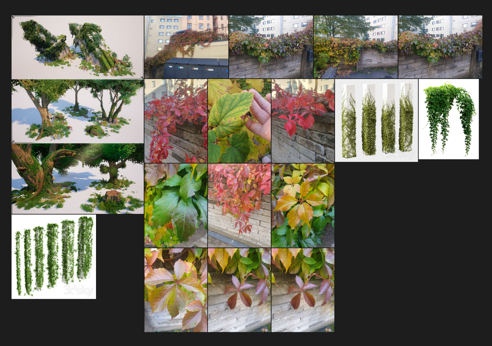
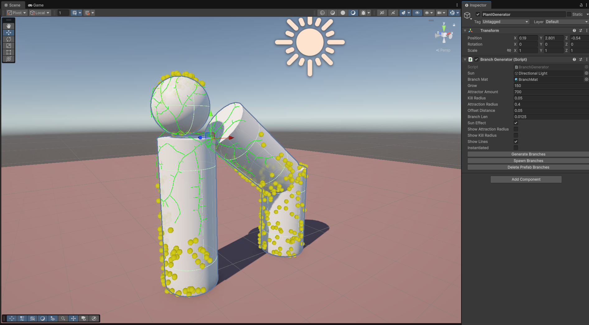
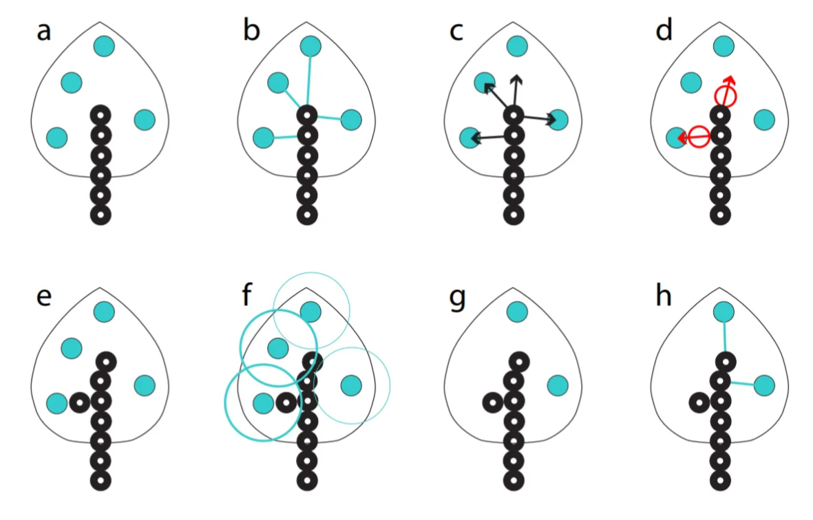
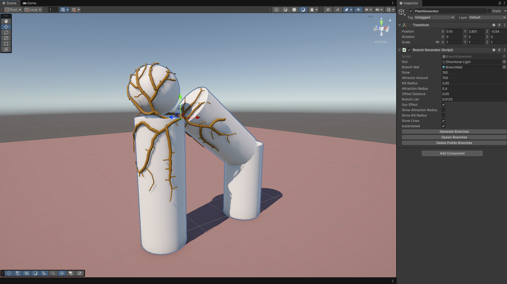

<link rel="stylesheet" href="assets/css/custom.css">

# Technical Artist Portfolio

---------------------------------------------------------------------------------------------------------------------------------------------------------------

## About Me

Experienced 3D artist with more than 7 years of experience from the mobile game industry, including senior and lead roles. I am currently expanding my technical skillset through an intensive software engineering program at [Hive Helsinki](https://www.hive.fi/), to develop as a technical artist who connects art and code.

## Contact Details
- [Linkedin](https://www.linkedin.com/in/emilia-haanp%C3%A4%C3%A4-25a88070)
- [ArtStation](https://www.artstation.com/emihaa)
- [Github](https://github.com/Emihaa)
- <a href="CV-2025.pdf">CV</a>

---------------------------------------------------------------------------------------------------------------------------------------------------------------
---------------------------------------------------------------------------------------------------------------------------------------------------------------
---------------------------------------------------------------------------------------------------------------------------------------------------------------
## Technical Artist projects

  

    
  

  

    
  

[Space Colonization Algorithm in Unity](https://emihaa.github.io/portfolio/space_colonization/space_colonization.html)    |   [Blender automatization script](2.md) 

## Teaching Courses / Xamk

  

    
  

  

    
  

[3D Environment Art](2.md)    |    [3D Character Art](2.md) 

# Technical Artist, blog

# [Space Colonization Algorithm, Unity/C# October 2025](https://github.com/Emihaa/Space_colonization_for_Unity)

## Mentor Project #2: Creating a Space Colonization Algorithm for Unity

My second mentor project focused on implementing the Space Colonization Algorithm in Unity using C#. The goal was to simulate an organic branching growth system that I could later expand into an ivy-like procedural plant generator.
Although I had used Unity years ago for virtual reality projects, this was my first time applying my current programming knowledge to Unity's own scripting API. The difference was huge: this time, I wasn’t just following tutorials, but I was designing and creating my own logic.

## Goal

To create a branching system based on the Space Colonization Algorithm, I had/have this ambitious goal of building an artist-friendly tool for procedural ivy growth in Unity.
Planned features included:

- Generating ivy growth around any target mesh(s)
- Controlling offsets, density, and color variation
- Masking growth areas
- Generating leaves and adjusting branch thickness

(Really ambitious, I know)

## Research

I started by studying the algorithm first. The article “Modeling Organic Branching Structures with the Space Colonization Algorithm and JavaScript” by Jason Webb [(link)](https://medium.com/@jason.webb/space-colonization-algorithm-in-javascript-6f683b743dc5) was the best thing that made the algorithm click for me. It explained the foundation of the algorithm clearly so that I felt that I could write it into C# and Unity’s environment.

## Implementation

### Generating attraction points

I began by generating attraction points over the target mesh surface.
Initially, I looped through every triangle of a mesh and generated a random point inside each, but that resulted in uneven distribution because smaller triangles accumulated unnecessarily many points, and larger triangles were noticeably emptier.
To fix this, I implemented a weighted random algorithm [(link)](https://dev.to/jacktt/understanding-the-weighted-random-algorithm-581p) that calculated each triangle’s area and distributed attraction points proportionally. This produced a much more natural, even spread.
I also added an optional feature that prevented attraction points from spawning on the dark side of the mesh (based on the sun direction). This was a simple dot-product check between the triangle vector and the sun vector, if the result was negative, the triangle was skipped, and no attraction points would spawn on it.

### Building the branching system

I implemented a Node class using a linked list structure to represent branches.
Each node stores:
- Position, direction, and thickness values
- References to next and previous nodes
- List of attractors that are currently affecting this node
- And many other attributes

Then it was time to utilize the Space Colonization algorithm. The algorithm searches for attractors that affect the nodes, then calculates the direction toward active attractors within a given attraction radius and spawns new nodes in those directions. For better clarity, see the image below. 
To optimize performance, I looped through attraction points (rather than every node) and checked which nodes were within their attraction radius. Since each attractor can only affect one node, this was much more efficient than going through each node and each time looping through all of the attraction points.
If the new nodes were initialized too close to the affecting attractors (so they were inside the “kill distance” radius), that attractor point was destroyed. This loop continued until no new nodes could be generated or the user-defined iteration limit was reached.

Source: Modeling Trees with a Space Colonization Algorithm, by Adam Runions, Brendan Lane, and Przemyslaw Prusinkiewicz [(link PDF)](https://algorithmicbotany.org/papers/colonization.egwnp2007.large.pdf)

### Visualization and controls

To visualize growth, I used Unity Gizmos and Debug.DrawLine() to draw branches dynamically in the Scene view.
I also built a custom inspector to control settings, adjusting attraction radius, growth iterations, and regeneration of attractor, among others.
This made debugging and iteration smoother, and gave me a clear understanding of how each parameter affected the results.
I also wanted to uphold the artist friendliness goal of my project. 

### Building geometry

Once the algorithm worked, I wanted something (digital) physical to show, not just Gizmos.
At first, I instantiated cylinder prefabs for each node. It technically worked, but scaling and rotation issues made it visually meh. I considered fixing that, but realized this would be a bubblegum solution quickly and one fix would unavoidably generate new issues.
After researching alternatives, I found this blog post [(link)](https://ciphrd.com/2019/09/11/generating-a-3d-growing-tree-using-a-space-colonization-algorithm/) describing how to procedurally generate a mesh tree for branching structures. With some help from ChatGPT, to help explain the code examples, I was able to understand the explanations and adapt that logic to my code, allowing me to generate a unified mesh branches instead of stacking prefabs.
As per the Jason Webb Colinization algorithm, I also added a branch thickness leveling, branches grow thicker toward the root depending on their chain amount. It gave the branch look more realism.

## Results and Reflection

The project met all my coding goals for now. The algorithm works, the branches grow correctly, and I am happy with my learning.
From a coder’s perspective, I’m proud of the structure, clarity, and optimization of my code.
From an artist’s perspective, my heart bleeds. The script works beautifully, but it’s not yet visually beautiful.

## Next Steps

There is still many things I want to do, and I plan to visit this project at some point to:

- Detect sharp mesh edges and generate additional attraction points on the vertex points so that the branch won't go inside the mesh
- Prevent attractor placement inside overlapping meshes
- Improve branch thickness logic and close the holes at the end of branches
- Generate ivy leaves with color variation

I didn't find this project so difficult, but rather a lot of work. It was a humbling experience to realize that my beautiful Pureref references didn’t even come close to being utilized yet.
I have never done a project like this before, and the challenge was fun and satisfying. It was also eye-opening to realize how much of what I have learned at Hive School I was able to utilize here, even though the projects we do at school have nothing to do with technical art.
At school, we have programmed in C and C++, so C# as an object-oriented programming language felt approachable and easy to grasp. A linked list is something I have already built once, in a much more complex logic, during our schools Minishell project, so utilizing that here was a no-brainer.
I realize that this type of project can easily be honed forever, and such projects are dangerous but also fun.

---------------------------------------------------------------------------------------------------------------------------------------------------------------
---------------------------------------------------------------------------------------------------------------------------------------------------------------

# [Automated Blender Script, Python September 2025](https://github.com/Emihaa/BlenderSpheres)

## My First Mentor Assignment: Automating Sphere Growth in Blender with Python

When I started at Hive Helsinki in October 2024, my goal was to strengthen my foundational programming skills to support my path toward becoming a technical artist. A year into the curriculum, I reached out to [Antti Veräjänkorpi](https://www.linkedin.com/in/anttiv79/) (Bit of Byte), asking him to be my mentor and to help me build my Technical Artist portfolio.
He gave me a Blender automation script assignment to assess my coding skills, logical thinking, and creative problem-solving. The assignment sounded simple at first, but it quickly turned into a fun and challenging project that taught me far more than I expected.

## The Assignment

Goal:
- Create a Blender script that optimizes circle or sphere sizes to their maximum extent.
- Do this within the given rectangular space (optional).

Constraints:
- Should have input to define how many spheres there is.
- Non of the spheres should not overlap.
- Each created sphere should have a randomized radius within some defined range of values.

The Example Image Explanation:
Colored circles show the initial state of the circles. Dashed circles around them are the state when they are I their most extended state within the given rectangular space, without overlapping.

## My Approach

I had two weeks to complete the assignment. This was my first time scripting in Blender and also my first project in Python, so I had to learn both the Blender API and the Python syntax.
I first figured out how to instantiate the spheres in Blender based on the given constraints (inside a box basically).

After that, I built a while loop that iteratively grew each sphere. In each iteration:
The script calculated the distance between every pair of spheres.
It subtracted the radii of both spheres from that distance and halved the result.
That value determined how much each sphere could grow without overlapping.
If the remaining space between any two spheres was smaller than a given epsilon threshold, the growth stopped.
Then do the same to the next sphere.

When none of the spheres could grow anymore, the loop ended, leaving a set of perfectly optimized, non-overlapping spheres filling the space.
The last thing I did was this white-noise scatter logic to generate random initial positions for the spheres, making sure none of them spawned inside each other.

More of that here if you are interested: [Link here.](https://extremelearning.com.au/unreasonable-effectiveness-of-quasirandom-sequences/)
  
      
 

## The Feedback

The feedback I received was eye-opening.

Even though my script was working, an accomplishment I was very proud of, considering I had learned Python syntax and completed my first script with it within two weeks while working and studying, my mentor’s feedback made me rewrite the core of my script 3 times.
The biggest lesson I learned was to separate the code from the art. Coming from a 3D art background, I naturally tend to approach problems visually. My first reaction was to spawn all the spheres immediately, because that’s what made sense visually. But in programming, especially for optimization tasks, this is unnecessary and not optimized.

Instead, I learned that I should first run the logic and math in the background, and only after everything is calculated, instantiate the visuals. No one sees the spheres growing in real time anyway, so why waste computation on scaling them physically?
This realization made my script simpler, lighter, and faster. And also shorter. I rewrote it so that each sphere became a Sphere class, storing all its necessary parameters like position and radius of the sphere. The growth now happens entirely in data, not in visible geometry, and only after the process is complete are the final spheres instantiated in Blender visible to the user.

The second major improvement was code reusability. My first solution used a custom white-noise system to scatter the spheres randomly without overlap. It worked, but it was just a bit unnecessary. In my rewritten version, I added a checkCollision() function to handle overlap detection and reused that same function for both position generation and the growth logic.
This meant less code, more clarity, and better readability.

## Reflection

Overall, I had a lot of fun working on this assignment.
Python turned out to be far less intimidating than I expected, especially after getting used to C and C++ at Hive. It actually felt quite approachable.

I do miss my curly brackets, though.

---------------------------------------------------------------------------------------------------------------------------------------------------------------
---------------------------------------------------------------------------------------------------------------------------------------------------------------
---------------------------------------------------------------------------------------------------------------------------------------------------------------

# Course lecturer at Xamk, University of Applied Sciences

I have two courses that I have been teaching since the beginning of 2024. *3D Environment Design & 3D Character Design.*

In both courses, I combine artistic principles with technical workflows, giving students skills and creativity to bring their ideas to life, but also the technical understanding needed for the pipeline of game production. My goal as a teacher is also to share practical knowledge and industry insight for students that wish to enter the game industry and find their footing.

---------------------------------------------------------------------------------------------------------------------------------------------------------------

# 3D Environment Design

*Image example of my course planning from Spring 2025*

As I did with the 3D Character Design course, I designed and developed this course from the ground up as well, including its structure, assignments, and study materials. In my course, students learn the complete 3D asset creation pipeline, starting with Blender and progressing all the way into a game engine. I provide tailored study materials, including articles I have written and resources from other industry professionals. The course is structured around both individual and team projects: smaller assignments and case studies build technical foundations, while a larger 3D environment project gives students the chance to apply their skills in a teamwork setting. I am solely responsible for managing deadlines, student communication, and feedback, delivering the course through a mix of online lectures, hands-on workshops, and regular critique sessions.

*Article I have written about textures and Physical Based Rendering materials*

*Pipeline explanation about modular design methods to help students familiarize themselves with the subject and to use it in their project pipeline*

---------------------------------------------------------------------------------------------------------------------------------------------------------------
---------------------------------------------------------------------------------------------------------------------------------------------------------------

# 3D Character Design

*Image example of my course plan from Spring 2025 (much more straight forward than 3D Environment Design -course)*

I designed this course from the ground up, creating its structure, assignments, and study materials. The course guides students through the full pipeline of producing stylized 3D characters for games, from concept art to a rig-ready 3D model. Students practice sculpting, retopology, UV mapping, texturing, and preparing the character for animation. The process emphasizes iteration, critique sessions, and structured feedback, helping students refine their characters step by step into game-ready standard. I am solely responsible for managing deadlines, assignments, and student communication, while delivering the course through a mix of lectures, hands-on workshops, and feedback sessions.

*The character design concept that I follow throughout the course.*

*Example of 3D character design during one of the phases within the course*

