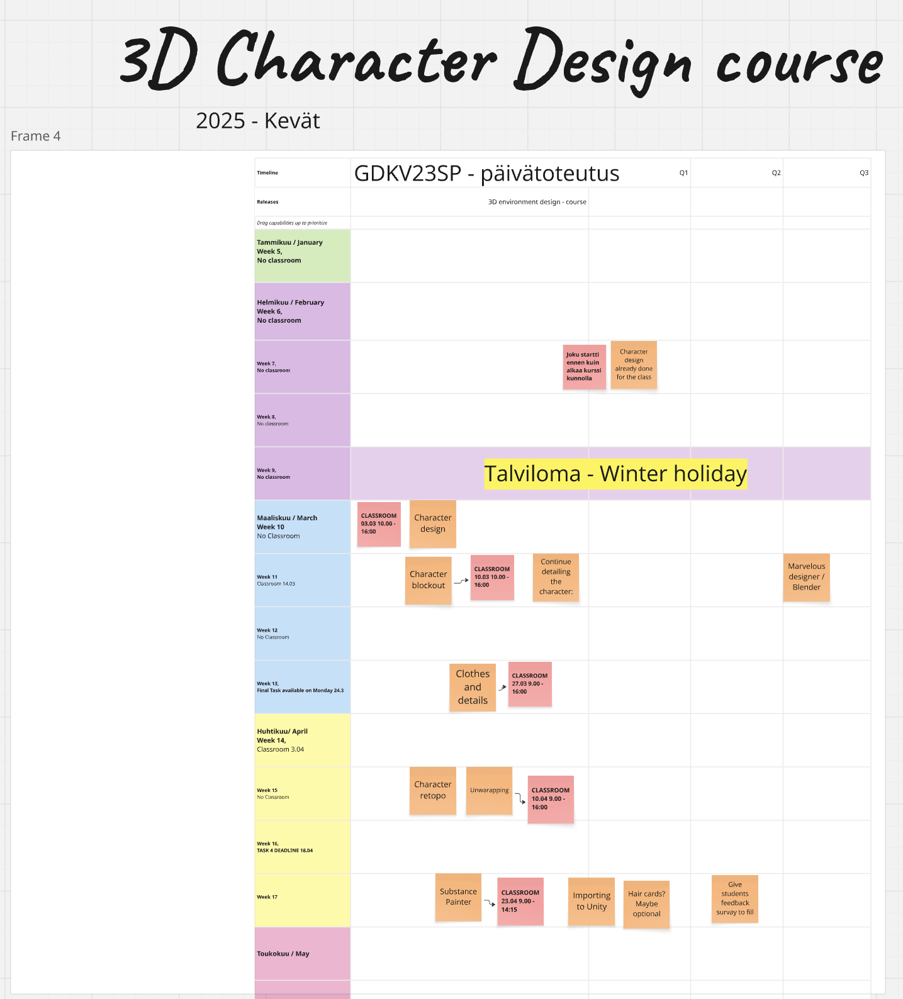
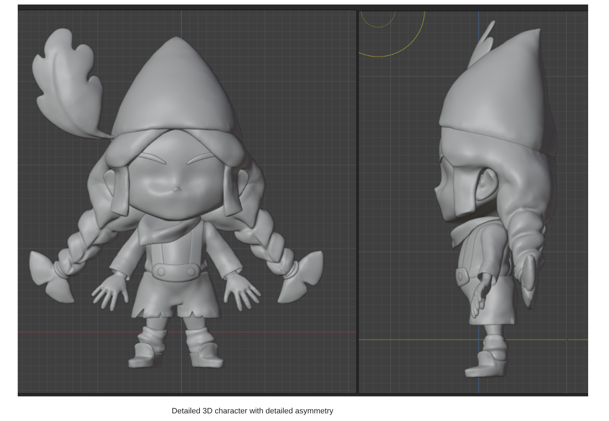

# 3D Character Design

*Image example of my course plan from Spring 2025 (much more straightforward than 3D Environment Design -course)*

I designed this course from the ground up, creating its structure, assignments, and study materials. The course guides students through the full pipeline of producing stylized 3D characters for games, from concept art to a rig-ready 3D model. Students practice sculpting, retopology, UV mapping, texturing, and preparing the character for animation. The process emphasizes iteration, critique sessions, and structured feedback, helping students refine their characters step by step into game-ready standard. I am solely responsible for managing deadlines, assignments, and student communication, while delivering the course through a mix of lectures, hands-on workshops, and feedback sessions.

*The character design concept that I follow throughout the course.*

*Example of 3D character design during one of the phases within the course*
