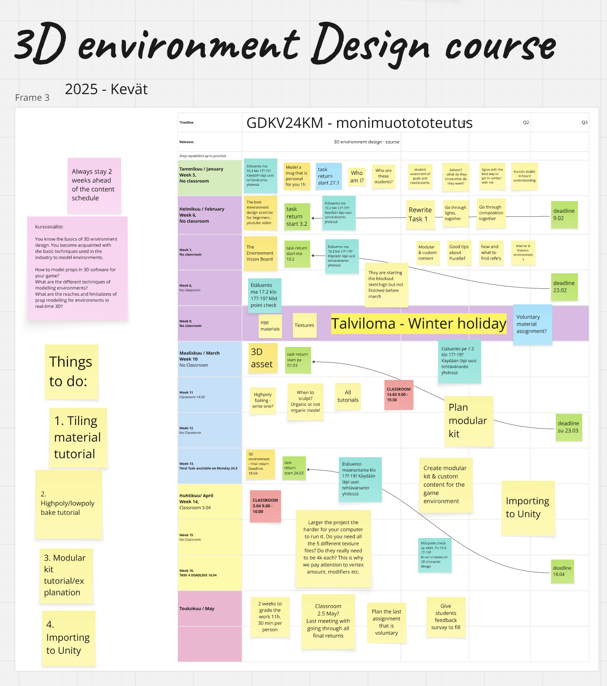
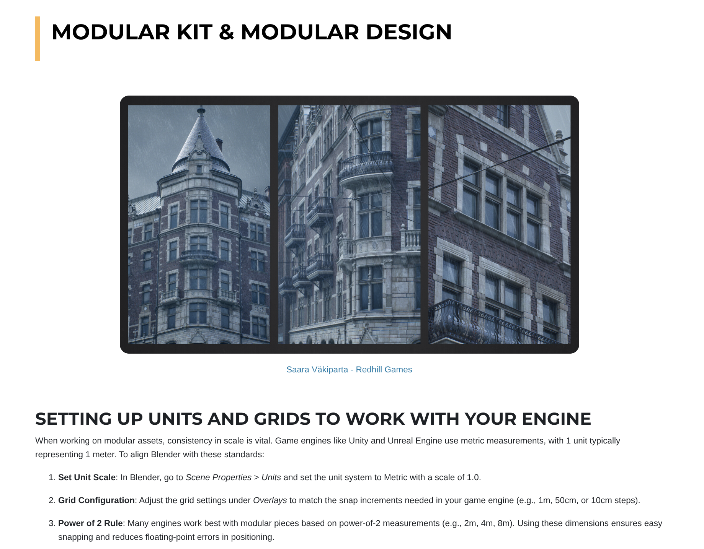

# 3D Environment Design

*Image example of my course planning from Spring 2025*

As I did with the 3D Character Design course, I designed and developed this course from the ground up as well, including its structure, assignments, and study materials. In my course, students learn the complete 3D asset creation pipeline, starting with Blender and progressing all the way into a game engine. I provide tailored study materials, including articles I have written and resources from other industry professionals. The course is structured around both individual and team projects: smaller assignments and case studies build technical foundations, while a larger 3D environment project gives students the chance to apply their skills in a teamwork setting. I am solely responsible for managing deadlines, student communication, and feedback, delivering the course through a mix of online lectures, hands-on workshops, and regular critique sessions.

*Article I have written about textures and Physical Based Rendering materials*

*Pipeline explanation about modular design methods to help students familiarize themselves with the subject and to use it in their project pipeline*

---------------------------------------------------------------------------------------------------------------------------------------------------------------
---------------------------------------------------------------------------------------------------------------------------------------------------------------
