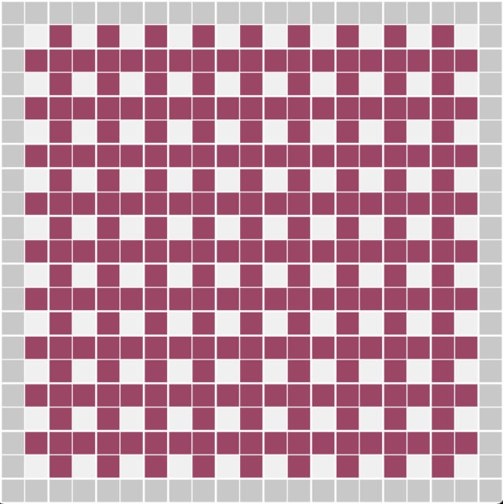

# [Maze Generation in Python, September 2025](https://github.com/Emihaa/MazeAlgorithm)

## Assignment Context

This project was created as part of a mentor assignment focused on algorithmic thinking and procedural generation. The main constraint was that the maze had to be built using cubes instead of lines, similar to [Kruskals Algorithm](https://medium.com/@batbat.senturk/kruskals-algorithm-the-most-visually-satisfying-maze-generation-c5c565844a4e), which pushed the solution toward a grid-based representation rather than a line-drawn maze. Optional bonus goals included ensuring full maze accessibility and supporting generation using a seed value.

## Start

After discussing tool choices with my mentor, I decided to implement the project in Python, as it is commonly expected from technical artists and a great second Python addition to my portfolio. For visualization, I chose Pygame instead of Python’s turtle module, as recommended by my mentor, as Pygame’s rendering and event-handling model felt closer to the MLX42 graphics library we had used in earlier school projects at Hive Helsinki.

The maze itself is represented as a 2D grid of cubes classified as borders, walls, or rooms. During generation, wall cubes are randomly selected and evaluated for removal. A wall can only be removed if it separates exactly two previously unconnected rooms. The overall approach is inspired by Kruskal-style maze generation, adapted to a cube-based grid.

## Flood Fill

To validate connectivity, I implemented a recursive flood fill algorithm. When given randomly a wall, flood fill is run from all sides (north, east, south, and west) to determine whether the adjacent rooms are already connected to each other. If they share reachable areas, they are part of the same room, if not, we can calculate them as separate rooms. The wall is only removed if is connected to two different rooms. While the logic was straightforward and works correctly, I do notice a need for cleaner code and optimisation as my flood fill functions turned out a bit messy.

## Visualization and UX

Maze generation is visualized in real time using Pygame's own event handling. I implemented an animated generation loop along with basic keyboard controls for pause and reset the process, adjust generation speed, and change the random seed during runtime. Using a fixed seed from the random module ensures that the same input always produces the same maze layout, and so fullfils one of the bonus elements.

## Thoughts

One of the key lessons from this project was related to code organization. Early reliance on Pygame tutorials that used global variables made later cleaning and organizing of the code difficult. In hindsight, the project would have benefited from a clearer class-based structure for the code. Despite this, the code functions as reguired, and the experience highlighted areas where I want to improve my approach to clean and maintainable code.

The project later proved useful beyond its original meaning. I extended the maze with start and exit points and implemented a breadth-first search pathfinding algorithm to find the shortest path through the maze. I used this brilliant [Red Blob Games website](https://www.redblobgames.com/pathfinding/a-star/introduction.html) as a guide for my implementation. This served as an excellent foundation to learn pathfinding algorithm logic before implementing similar pathfinding in Go language for a separate school competition project as I had never done anything in Go before.

## Results

Overall, this project achieved its goals and stands as a portfolio example, and was great learning experience for more algorithms. It combines procedural generation, grid-based logic, real-time visualization, and algorithmic validation, while also teaching an important lesson for better planning and cleaner code structure for future projects.

---------------------------------------------------------------------------------------------------------------------------------------------------------------
---------------------------------------------------------------------------------------------------------------------------------------------------------------
