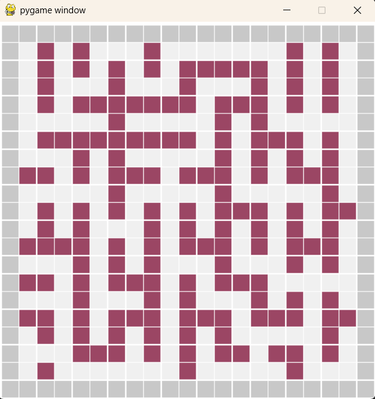
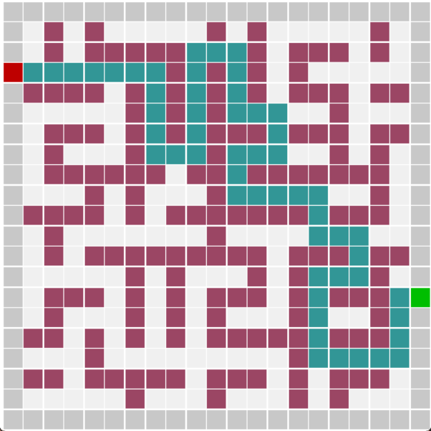

# [Maze Generation in Python, September 2025](https://github.com/Emihaa/MazeAlgorithm)

## Assignment Context

This project was created as part of a mentor assignment focused on algorithmic thinking and procedural generation. The main constraint was that the maze had to be built using cubes instead of lines, which pushed the solution toward a grid-based representation rather than a traditional line-drawn maze. Optional bonus goals included ensuring full maze accessibility and supporting deterministic generation using a seed value.

After discussing tool choices with my mentor, I decided to implement the project in Python, as it is commonly expected from technical artists and a meaningful addition to my portfolio. For visualization, I chose Pygame instead of Python’s turtle module, as Pygame’s rendering and event-handling model felt closer to the MLX42 graphics library we had used in earlier school projects.

The maze itself is represented as a grid of cubes classified as borders, walls, or rooms. During generation, wall cubes are randomly selected and evaluated for removal. A wall can only be removed if it separates exactly two previously unconnected rooms, ensuring that the maze remains fully traversable without introducing unintended shortcuts. The overall approach is inspired by Kruskal-style maze generation, adapted to a cube-based grid.

To validate connectivity, I implemented a flood fill algorithm. When evaluating a wall, flood fill is run from both sides to determine whether the adjacent rooms are already connected. If they share reachable areas, the wall must remain; if not, it can safely be removed. While the logic was straightforward and worked correctly, this part of the code revealed opportunities for cleaner structure and refactoring.

Maze generation is visualized in real time using Pygame. I implemented an animated generation loop along with basic keyboard controls to pause and reset the process, adjust generation speed, and change the random seed during runtime. Using a fixed seed ensures that the same input always produces the same maze layout.

One of the key lessons from this project was related to code organization. Early reliance on tutorials that used global variables made later refactoring difficult. In hindsight, the project would have benefited from a clearer class-based structure encapsulating maze state and behavior. Despite this, the code functions reliably, and the experience highlighted areas where I want to improve my approach to clean and maintainable code.

The project later proved useful beyond its original scope. I extended the maze with entrance and exit points and implemented a breadth-first search pathfinding algorithm to find the shortest path through the maze. This served as a practical stepping stone before implementing similar pathfinding logic in Go for a separate school competition project.

Overall, this project achieved its goals and stands as a strong portfolio example. It combines procedural generation, grid-based logic, real-time visualization, and algorithmic validation, while also marking an important learning step toward better planning and cleaner code structure in future projects.

---------------------------------------------------------------------------------------------------------------------------------------------------------------
---------------------------------------------------------------------------------------------------------------------------------------------------------------
