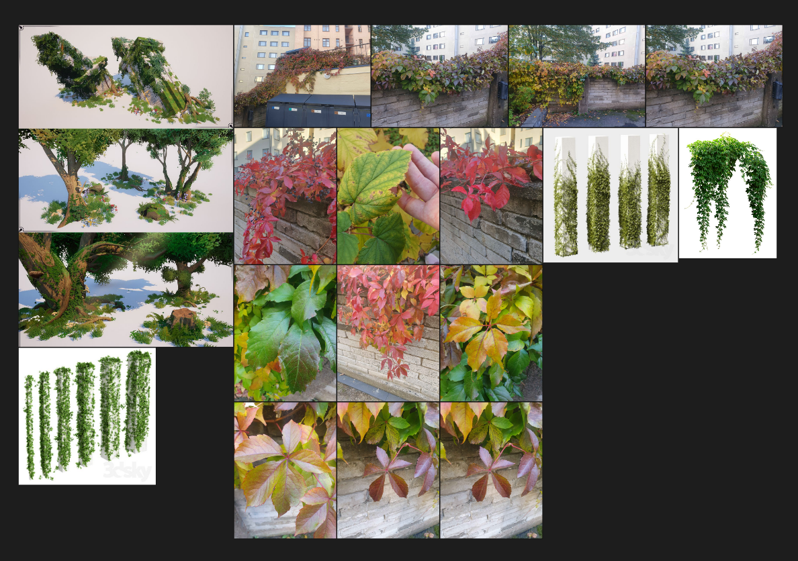
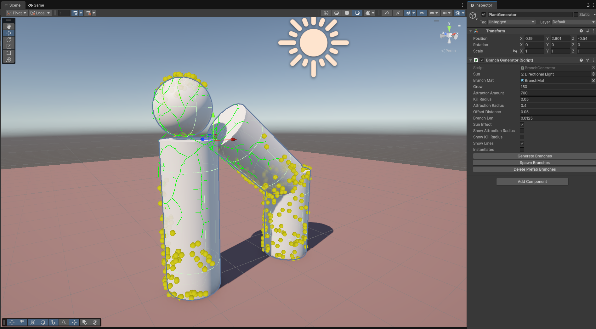
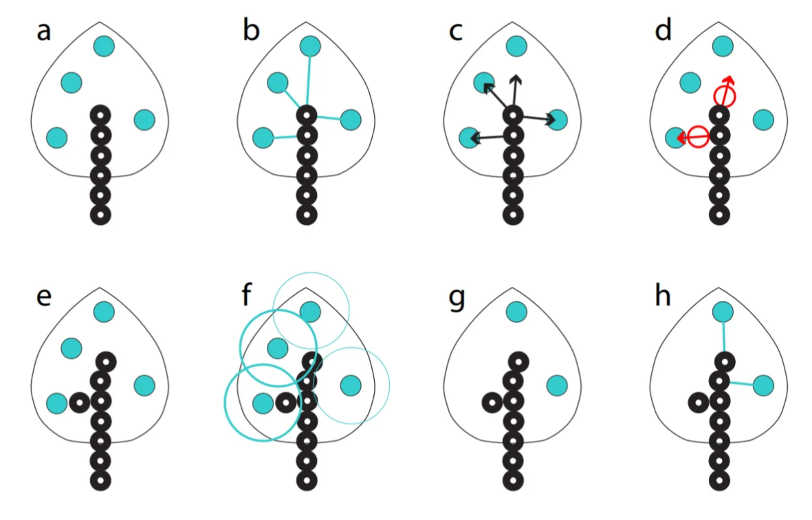
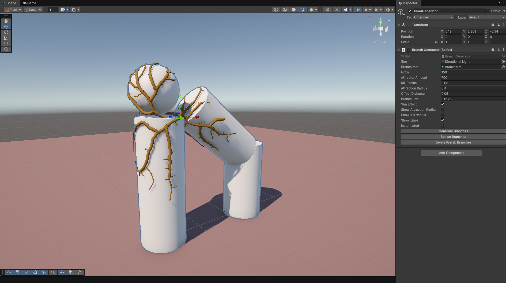

# [Space Colonization Algorithm, Unity/C# October 2025](https://github.com/Emihaa/Space_colonization_for_Unity)

## Mentor Project #2: Creating a Space Colonization Algorithm for Unity

My second mentor project focused on implementing the Space Colonization Algorithm in Unity using C#. The goal was to simulate an organic branching growth system that I could later expand into an ivy-like procedural plant generator.
Although I had used Unity years ago for virtual reality projects, this was my first time applying my current programming knowledge to Unity's own scripting API. The difference was huge: this time, I wasn’t just following tutorials, but I was designing and creating my own logic.

## Goal

To create a branching system based on the Space Colonization Algorithm, I had/have this ambitious goal of building an artist-friendly tool for procedural ivy growth in Unity.
Planned features included:

- Generating ivy growth around any target mesh(s)
- Controlling offsets, density, and color variation
- Masking growth areas
- Generating leaves and adjusting branch thickness

(Really ambitious, I know)

## Research

I started by studying the algorithm first. The article “Modeling Organic Branching Structures with the Space Colonization Algorithm and JavaScript” by Jason Webb [(link)](https://medium.com/@jason.webb/space-colonization-algorithm-in-javascript-6f683b743dc5) was the best thing that made the algorithm click for me. It explained the foundation of the algorithm clearly so that I felt that I could write it into C# and Unity’s environment.

## Implementation

### Generating attraction points

I began by generating attraction points over the target mesh surface.
Initially, I looped through every triangle of a mesh and generated a random point inside each, but that resulted in uneven distribution because smaller triangles accumulated unnecessarily many points, and larger triangles were noticeably emptier.
To fix this, I implemented a weighted random algorithm [(link)](https://dev.to/jacktt/understanding-the-weighted-random-algorithm-581p) that calculated each triangle’s area and distributed attraction points proportionally. This produced a much more natural, even spread.
I also added an optional feature that prevented attraction points from spawning on the dark side of the mesh (based on the sun direction). This was a simple dot-product check between the triangle vector and the sun vector, if the result was negative, the triangle was skipped, and no attraction points would spawn on it.

### Building the branching system

I implemented a Node class using a linked list structure to represent branches.
Each node stores:
- Position, direction, and thickness values
- References to next and previous nodes
- List of attractors that are currently affecting this node
- And many other attributes

Then it was time to utilize the Space Colonization algorithm. The algorithm searches for attractors that affect the nodes, then calculates the direction toward active attractors within a given attraction radius and spawns new nodes in those directions. For better clarity, see the image below. 
To optimize performance, I looped through attraction points (rather than every node) and checked which nodes were within their attraction radius. Since each attractor can only affect one node, this was much more efficient than going through each node and each time looping through all of the attraction points.
If the new nodes were initialized too close to the affecting attractors (so they were inside the “kill distance” radius), that attractor point was destroyed. This loop continued until no new nodes could be generated or the user-defined iteration limit was reached.

Source: Modeling Trees with a Space Colonization Algorithm, by Adam Runions, Brendan Lane, and Przemyslaw Prusinkiewicz [(link PDF)](https://algorithmicbotany.org/papers/colonization.egwnp2007.large.pdf)

### Visualization and controls

To visualize growth, I used Unity Gizmos and Debug.DrawLine() to draw branches dynamically in the Scene view.
I also built a custom inspector to control settings, adjusting attraction radius, growth iterations, and regeneration of attractor, among others.
This made debugging and iteration smoother, and gave me a clear understanding of how each parameter affected the results.
I also wanted to uphold the artist friendliness goal of my project. 

### Building geometry

Once the algorithm worked, I wanted something (digital) physical to show, not just Gizmos.
At first, I instantiated cylinder prefabs for each node. It technically worked, but scaling and rotation issues made it visually meh. I considered fixing that, but realized this would be a bubblegum solution quickly and one fix would unavoidably generate new issues.
After researching alternatives, I found this blog post [(link)](https://ciphrd.com/2019/09/11/generating-a-3d-growing-tree-using-a-space-colonization-algorithm/) describing how to procedurally generate a mesh tree for branching structures. With some help from ChatGPT, to help explain the code examples, I was able to understand the explanations and adapt that logic to my code, allowing me to generate a unified mesh branches instead of stacking prefabs.
As per the Jason Webb Colinization algorithm, I also added a branch thickness leveling, branches grow thicker toward the root depending on their chain amount. It gave the branch look more realism.

## Results and Reflection

The project met all my coding goals for now. The algorithm works, the branches grow correctly, and I am happy with my learning.
From a coder’s perspective, I’m proud of the structure, clarity, and optimization of my code.
From an artist’s perspective, my heart bleeds. The script works beautifully, but it’s not yet visually beautiful.

## Next Steps

There are still many things I want to do, and I plan to visit this project at some point to:

- Detect sharp mesh edges and generate additional attraction points on the vertex points so that the branch won't go inside the mesh
- Prevent attractor placement inside overlapping meshes
- Improve branch thickness logic and close the holes at the end of branches
- Generate ivy leaves with color variation

I didn't find this project so difficult, but rather a lot of work. It was a humbling experience to realize that my beautiful Pureref references didn’t even come close to being utilized yet.
I have never done a project like this before, and the challenge was fun and satisfying. It was also eye-opening to realize how much of what I have learned at Hive School I was able to utilize here, even though the projects we do at school have nothing to do with technical art.
At school, we have programmed in C and C++, so C# as an object-oriented programming language felt approachable and easy to grasp. A linked list is something I have already built once, in a much more complex logic, during our schools Minishell project, so utilizing that here was a no-brainer.
I realize that this type of project can easily be honed forever, and such projects are dangerous but also fun.

---------------------------------------------------------------------------------------------------------------------------------------------------------------
---------------------------------------------------------------------------------------------------------------------------------------------------------------
